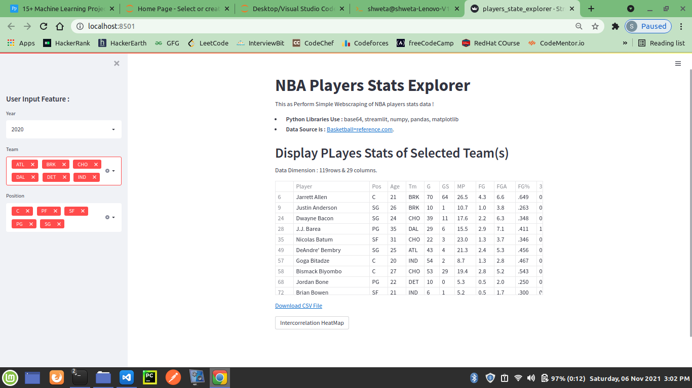
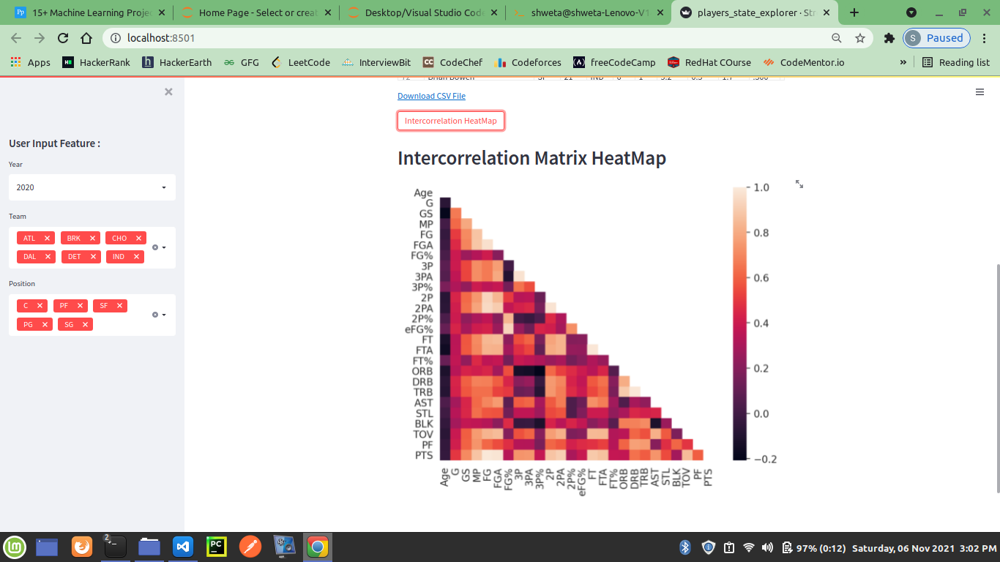

# NBA Players Stats Explorer

This as Perform Simple Webscraping of NBA players stats data !
* **Python Libraries Use :** base64, streamlit, numpy, pandas, matplotlib
* **Data Source is :** [Basketball=reference.com](https://www.basketball-reference.com/).

## Demo

  

  

